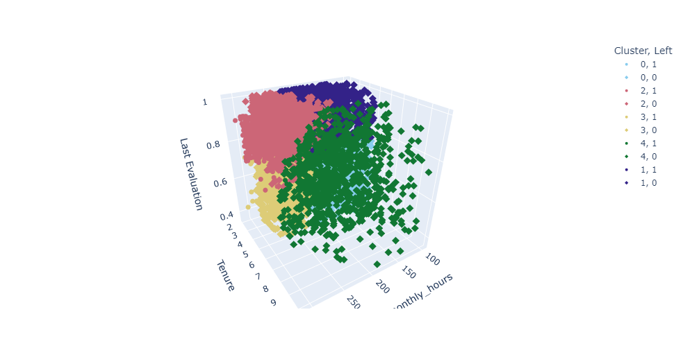
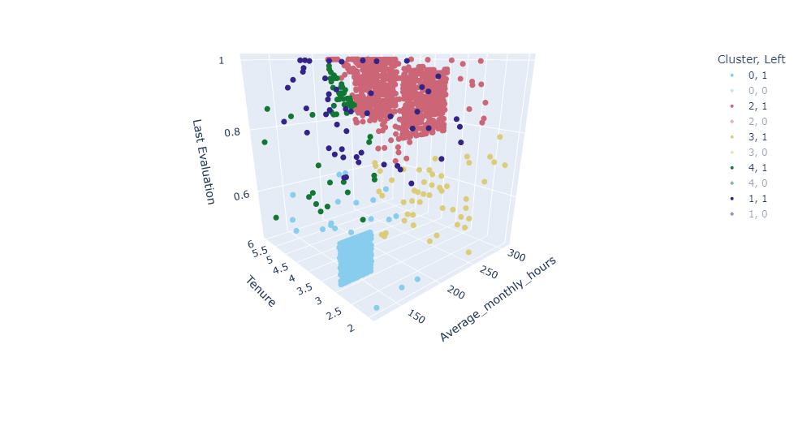

### Project overview

The goal of this project is to develop a supervised machine learning model - random forest - that predicts whether an employee leaves the company.
In addition, unsupervised model - K-means clustering - is performed to further explore the dataset.

### Project structure

1. Exploratory data analysis --> `EDA` notebook
2. Feature engineering & random forest model building --> `Modeling` notebook
3. Clustering using K-means algorithm - `Clustering` notebook

The notebooks use the functions included in `helper_functions.py` module

### Dataset

This is a capstone project of `Google Advanced Data Analytics` specialization

### Tools

- EDA: Pandas
- Building models: Scikit learn
- Data visualization: Matplotlib, Seaborn, Plotly

### Results

The random forest model showed that `last_evaluation`, `number_project` and `tenure` are top 3 most important features for making predictions. 
The model achieved a `recall` of ~90%, meaning it correctly identified 9 out of 10 employees who actually left the company. Taking into account the class imbalance that's a decent score.
The model was tuned using `GridSearchCV` and saved using pickle. The pickle file is available in the repository.
The K-means model divided the dataset into 5 clusters based onthe `elbow method` (inertia) and `silhouette score`. 

The chart below shows the employees from all clusters who actually left. There are two clusters with high percentage of leaving employees:

First group belongs to cluster 2 and consists of employees who worked more than ~220 hours a month and were highly evaluated during last evaluation. Their tenure ranges from 4 years to 6 years (two red squares in the chart below). It is possible that despite high evaluation scores they were too overworked and didn't anticipate a promotion in the near future. The second group consists of employees who worked less than 160 hours, their tenure was 3 years and they were evaluated significantly lower than the first group (blue square in the chart below). This group may represent the employees who were expecting to be dismissed soon and therefore they worked less and were evaluated lower.
